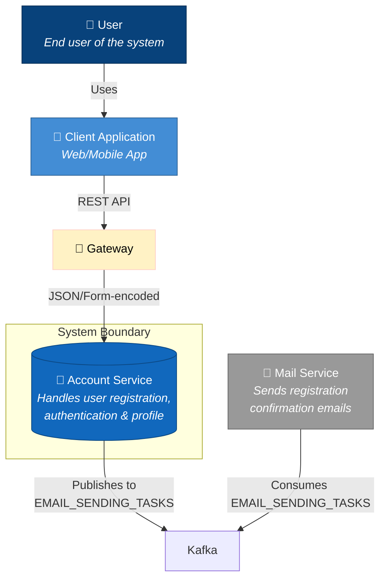
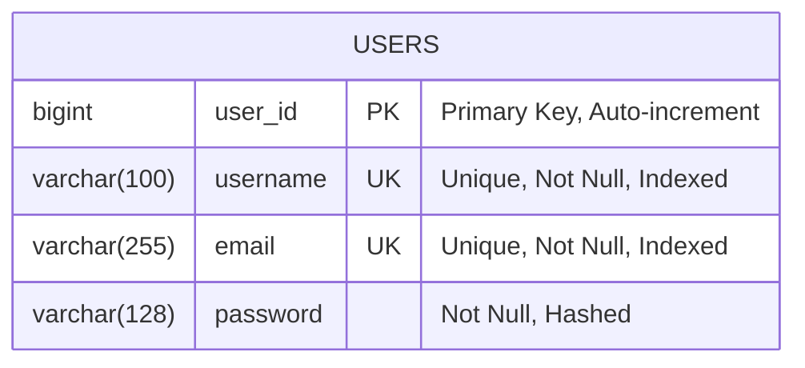
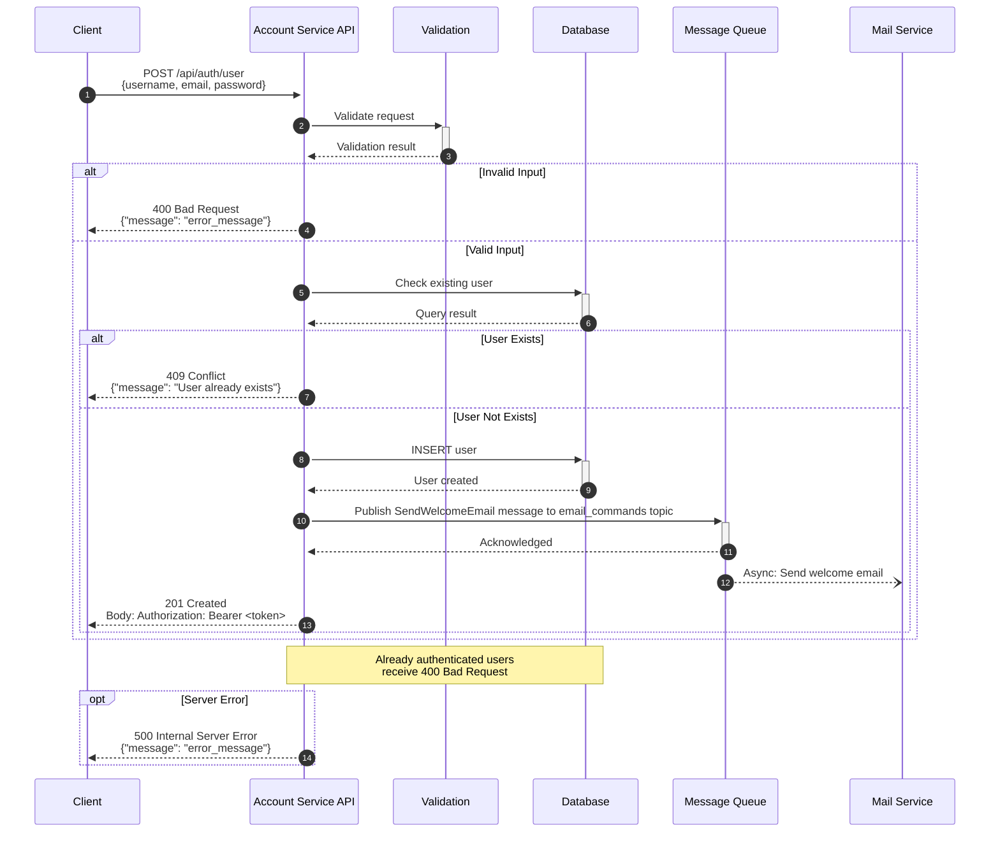
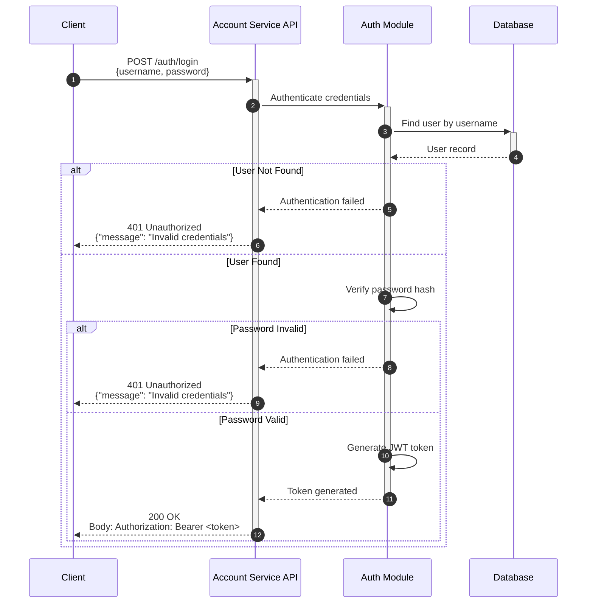
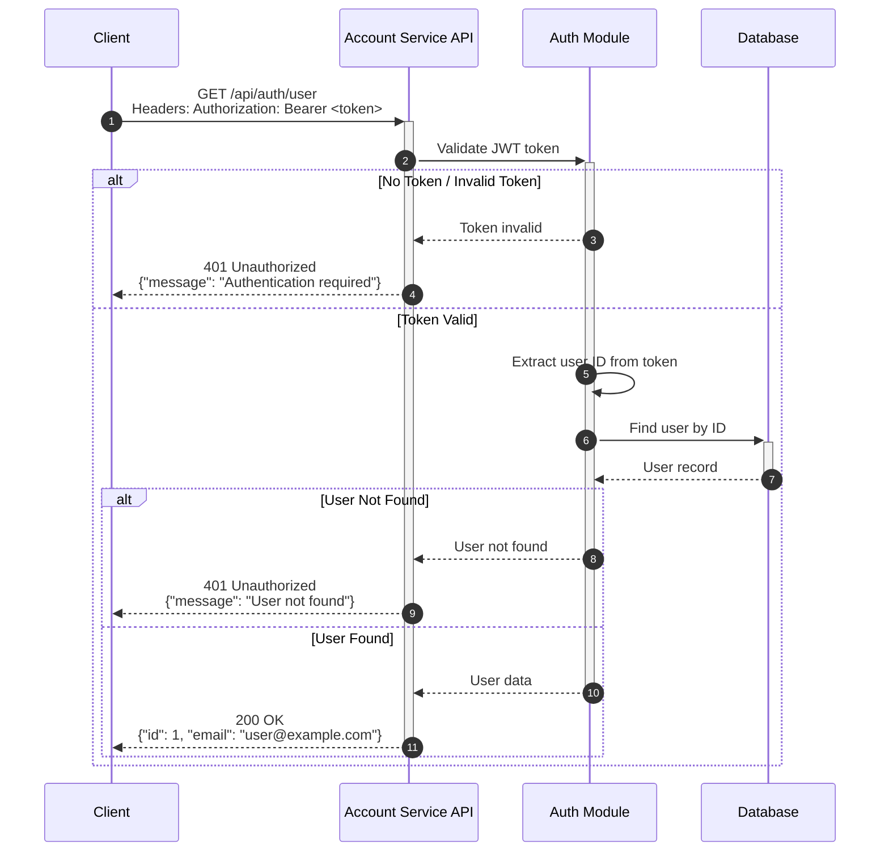

# Account Service
Responsible for authentication and authorization. Produces JWT-tokens and sends event to send authenticated-related emails.

---

## Interactions

---

## Database Schema

---

## Use case flows

### Registration

### Logging in

### Get user info

### Logging out

Happens on frontend-side as authentication is stateless JWT-based