# Task Management Service
Responsible for task creation, deletion, completion and updating task data. 

---

## Interactions

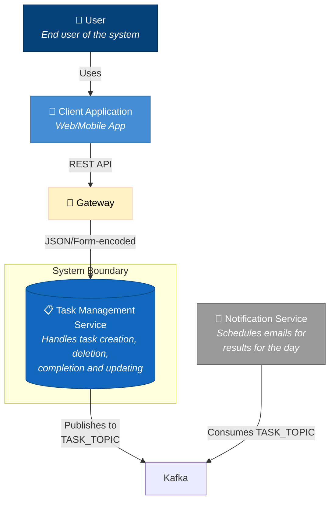

---

## Database Schema

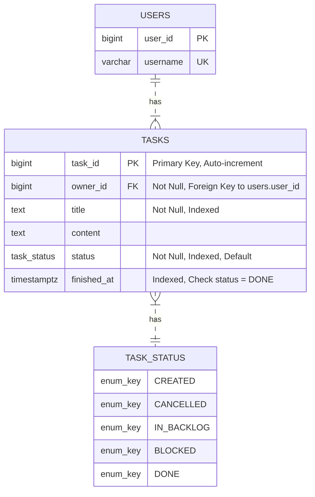
All indexes are composite with `owner_id`.

---

## Use case flows

### List Tasks
Get all tasks assigned to user. Paginated

```postgresql
SELECT * FROM tasks
WHERE owner_id = :ownerId
OFFSET :offset LIMIT :limit
```

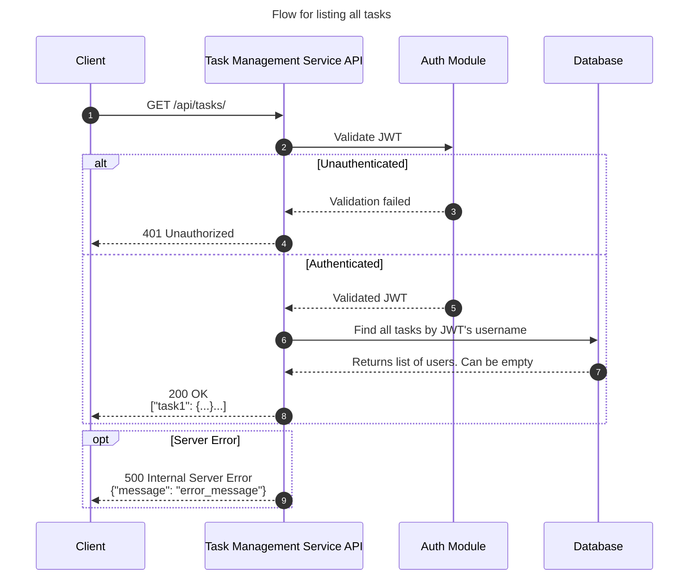

### Add Task

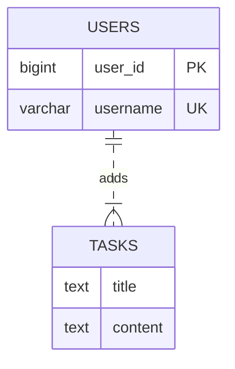

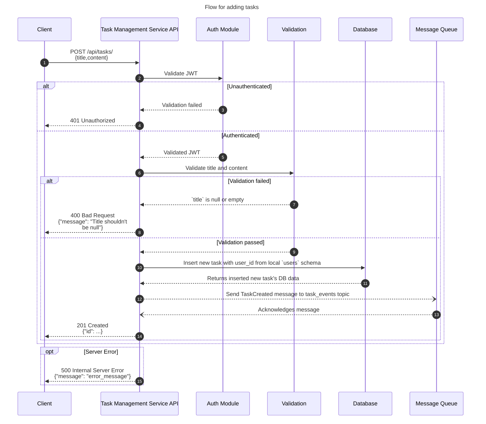

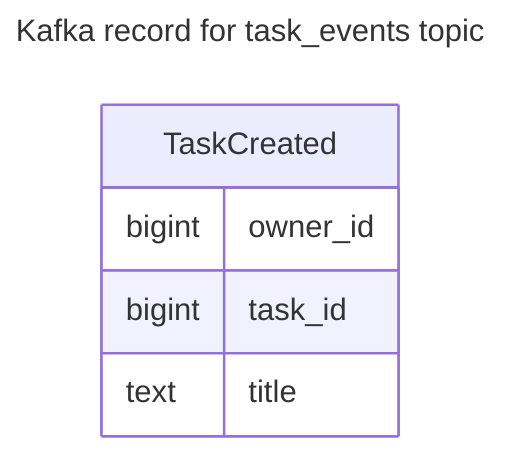

### Task Deletion

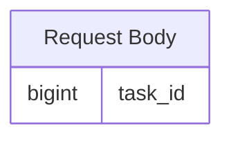
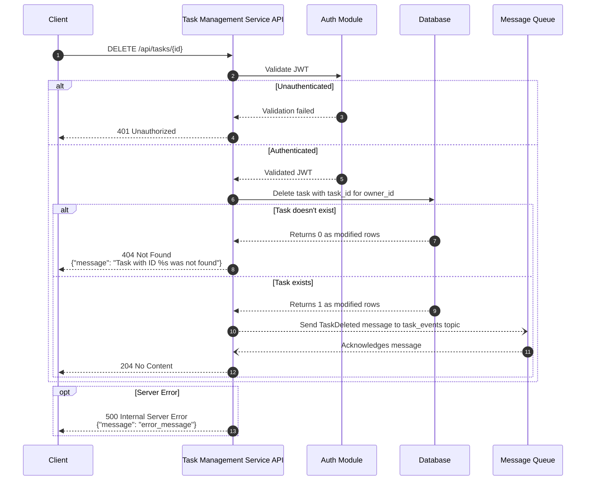
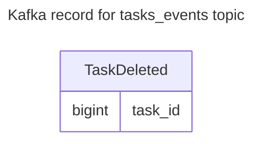

### Task Update

This action can update any part of the task, including its status. All properties except task_id are nullable, but if all are null, then the request is invalid. At least one nullable property should be set.
The request body itself can omit null values.
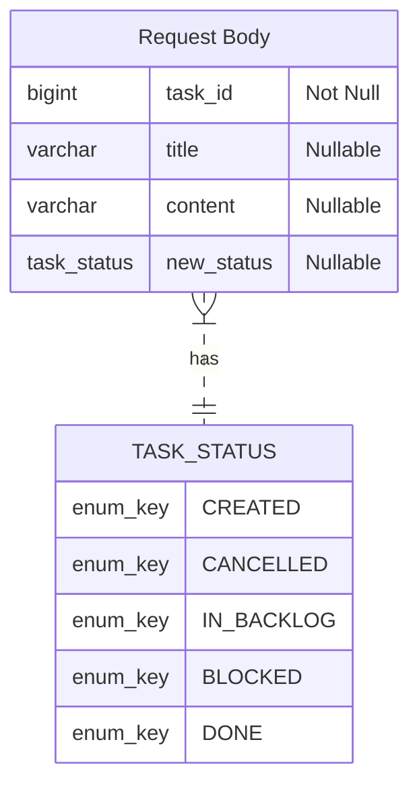
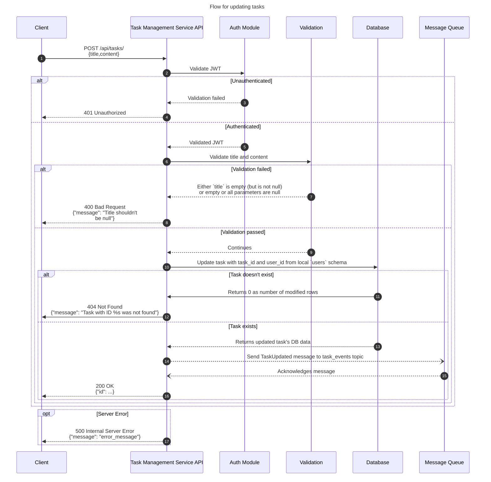
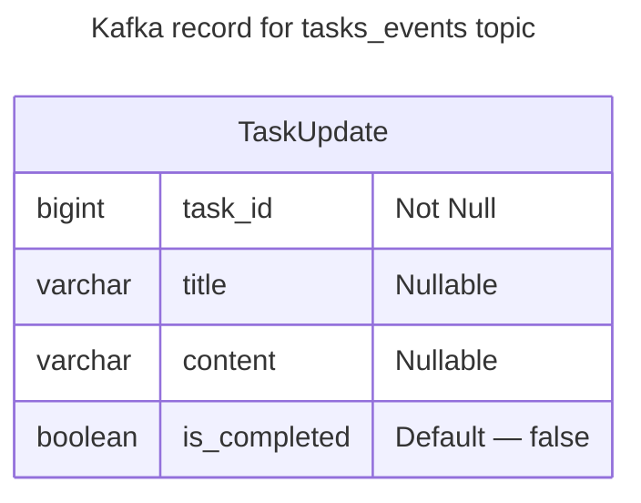